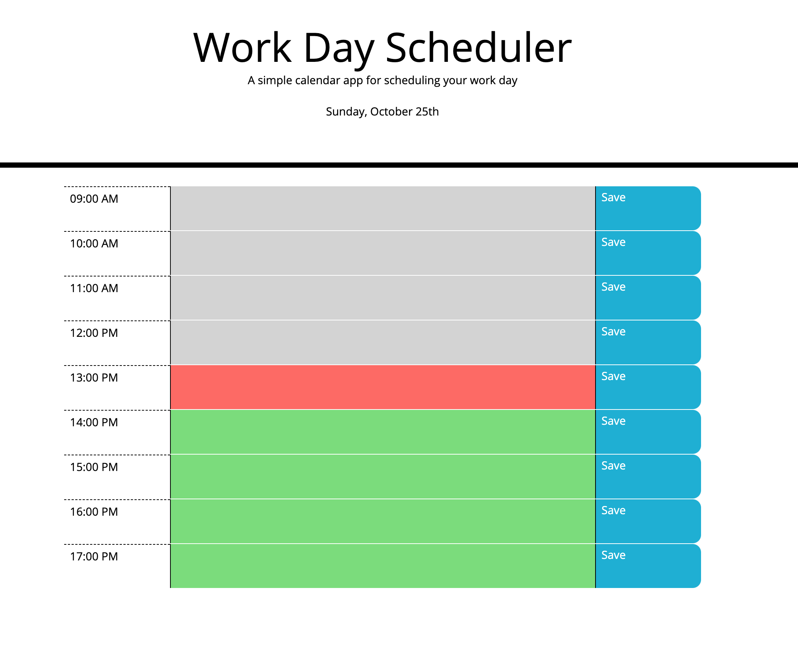
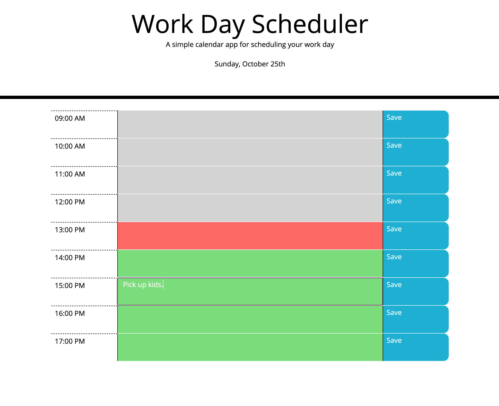
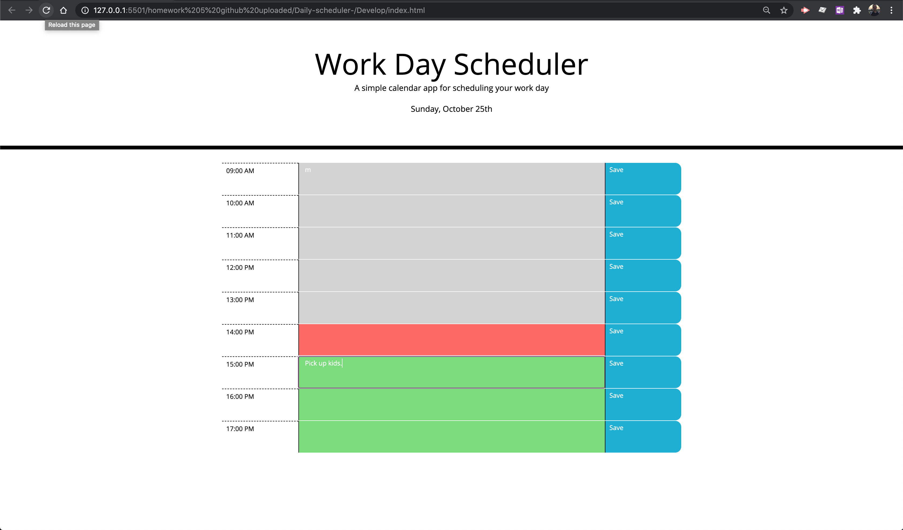
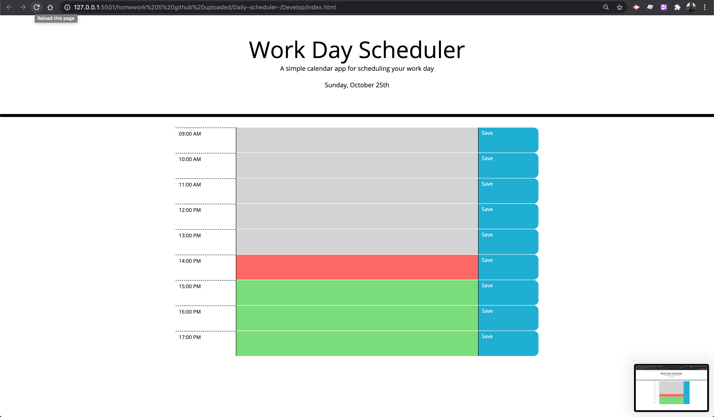

# Daily-scheduler
<<<<<<< HEAD

## how to use Daily schedule.

Make daily scheduler With the response color the current time

- Enter your task in the task field.
- click save button next to your text field area.
- to delete your task simple clear the field and click save again.
- To test the storage function click on refresh page and inputs should stay stored in memory

## Purpose of the application.

to have your tasks stored and never loss them

### built with

- HTML
- CSS
- JavaScript

**deployed application link**
https://bannoura9.github.io/Daily-scheduler/Develop/index.html

##### Screenshots.

  
  
  
  

=======
>>>>>>> 1067f98cc7c4792c2240645f7ca1b4018e09eb83
